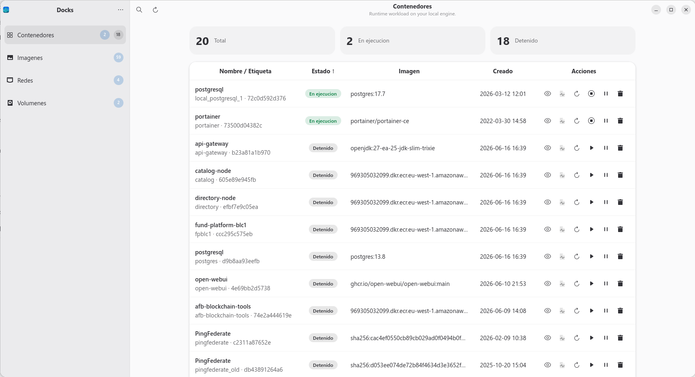
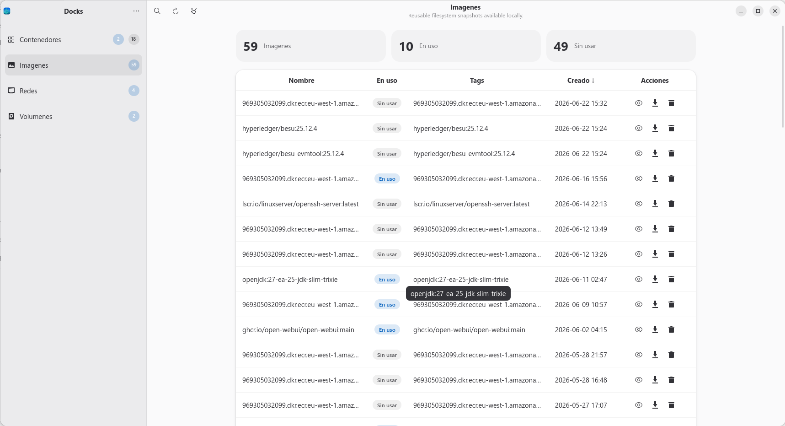
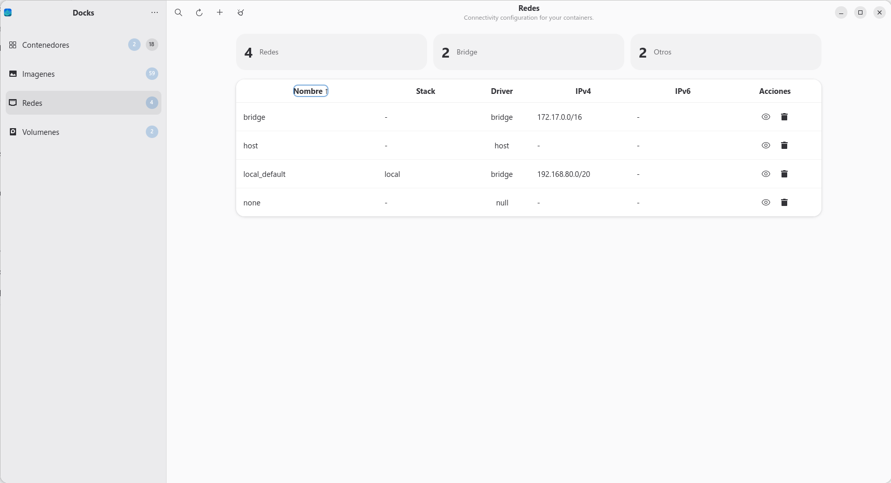
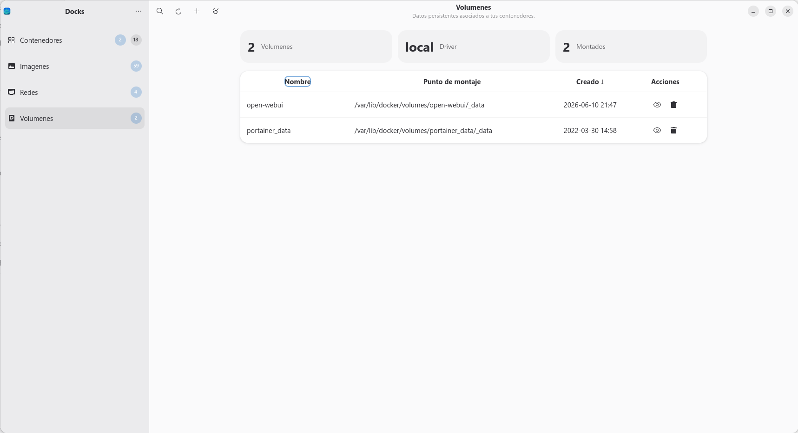

# Docks

`Docks` is a GTK4/libadwaita Docker desktop client for GNOME focused on the local Docker engine.



## Current Scope

Today the project is aimed at:

- local Docker only,
- containers, images, networks, and volumes,
- common day-to-day actions,
- a GNOME-native desktop experience.

It is not currently positioned as a remote Docker manager.

## Main Features

- Container, image, network, and volume listing
- Sorting and per-section search
- Detail views for all supported resource types
- Container lifecycle actions
- Container logs with follow, pause, copy, save, and configurable tail
- Image pull from the UI
- Network and volume creation
- Prune actions for unused images, networks, and volumes
- Manual refresh and automatic refresh through Docker events
- Language and color scheme preferences

## Requirements

- Python 3.10+
- GTK 4
- libadwaita 1
- PyGObject
- A local Docker engine accessible to the current user

## Install

```bash
python3 -m pip install -e .
```

## Run

```bash
PYTHONPATH=src python3 -m docks.main
```

Or:

```bash
docks
```

## Test

```bash
PYTHONPATH=src python3 -m unittest discover -s tests -v
```

## Screenshots

### Main Dashboard


### Container Details


### Images Registry


### Volumes and Networks


## Documentation

See [docs/index.md](./docs/index.md).
